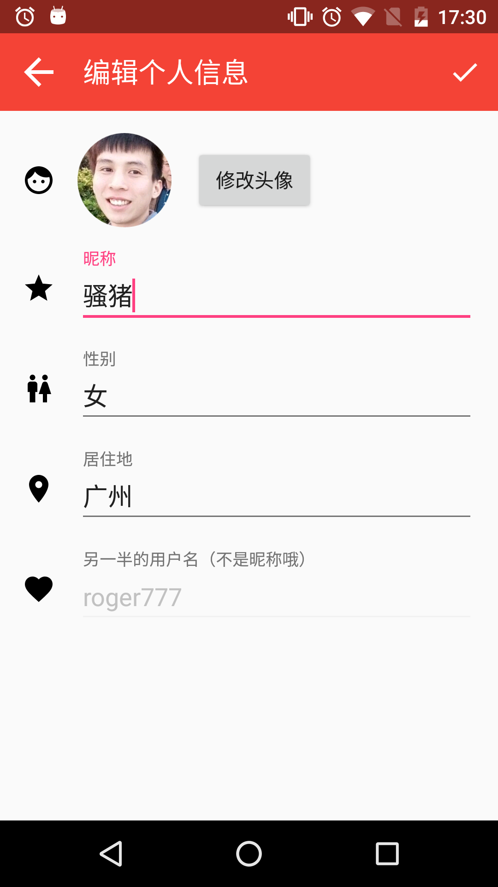
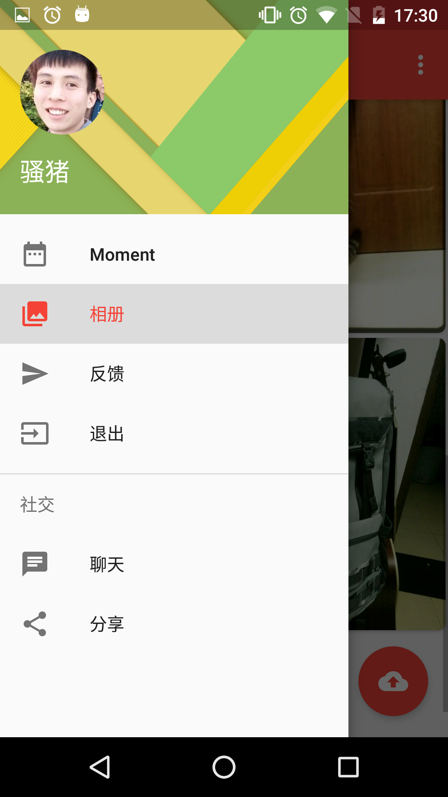
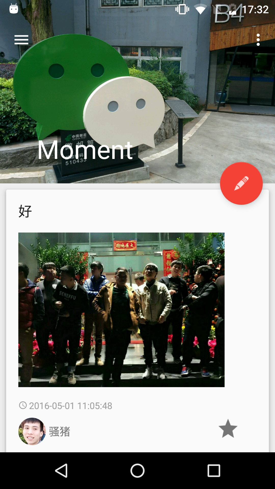
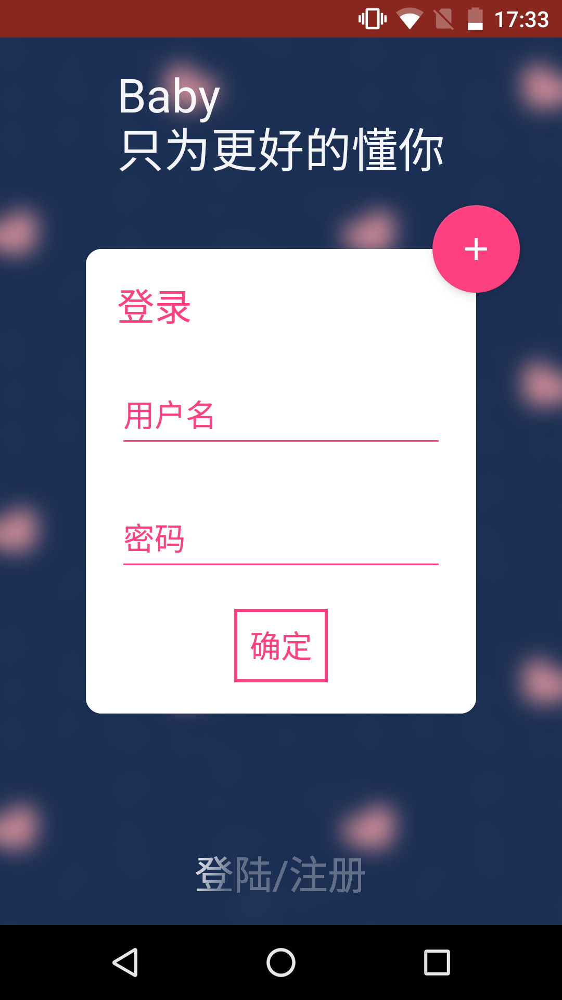

# Baby
# 一个恋爱社交APP

这个项目就当是学习一年安卓来的总结和学习的新技术的应用吧。
 (讲道理还是为了毕业设计做的)

##Download

  http://fir.im/b9u8

##Features
 
 
 


 * 开屏页的登录和注册
 * 首页的Moment
 * 相册页面
 * 编辑个人信息
 * 等等....

## Development Environment & Library

### MVP
这个项目是基于MVP框架写的（大体上，聊天那块直接用环信的了），大部分Base类参考[FastAndroid](https://github.com/huntermr/FastAndroid)里边的基类，参考这个很快就能布好基本的MVP架构。本来是有考虑过MVVM后来想想还是先学习一下MVP吧，看过几个MVVM项目感觉还是挺好用的，不过还是BETA版不知道有没有什么坑。

### MATERIAL DESIGN
早就手痒想体验一把V7包里边的各种控件了，特喜欢coordinatorlayout和collapsingtoolbarlayout的互动让Tollbar隐藏又现的感觉，但是看起来好看还是要点代价的，在这里捣鼓了不少时间，尤其是collapsingtoolbarlayout的Expanded固定让我Google了好久，因为用英文搜索可能我表达的不太好，最后竟然是一句nestedScroll(false)就可以了。。。。
还是感谢Stackoveflow里变的大腿吧。

### Dagger2
依赖注入[Dagger2](http://google.github.io/dagger/)，也是我早就想用的一个框架了，理由是各种配合Mvp十分方便和好用，渐渐也能体会到一次注入到处可用的快感。不过一个新技术真的学习成本，国内没什么中文文档介绍，看国外的看的云里雾里。原理看的明白，用起来好像不太知道如何使用，尤其是在@inject之后对象，也可以在别的地方Inject，原本是被Inject方后来也成了Module提供方。虽然到最后原理还不是特别明白这里，但还是不阻碍用起来的快感。

### Realm
一开始被新技术吸引到的是不会放过任何新东西的包括[Realm](https://github.com/realm/realm-java),不过进了坑不代表这个坑可以跳阿。由于我这次用到了leacncloud,Realm感觉会和LeanCloud的子类化冲突让你只能选择其中之一，不过这个也算了，Leancloud提供了类似Map的Put方法也可以接受就是麻烦了点。但是被坑到的地方是Realm所谓的自动数据同步竟然是一改就是改真实的数据，并不是数据的拷贝。。。感觉和我使用到要缓存的数据有点冲突，因为这个Moment里边的项是有点赞的，点赞要修改当前Recycleview的数据（修改数据要开事务）。修改数据后会出现一些很奇怪的现象，不在Recycleview当前Item会跳到当前Item，点赞的动画也会消失。。。真的是想破脑袋也解决不了，就直接跳坑了。最后感觉这个Realm在保存不跟服务器需要同步的数据会好点。

### LeanCloud
用[LeanCloud](leancloud.cn)是因为在知乎太多吹它的人了而且它的确在BAAS这方面功能比较多（后来才发现即时通信没有语音和视频），所以就尝试使用了，SDK整体来说是不错的都挺好用的，满足了我对存储方面的要求。不过就在我开发的这几天，貌似稳定性没有想象中那么好，好几次上传个头像都会SocketTimeOut，查询也会有点慢，不过还好都在接受范围内（不过要是到了收费的标准我就接受不了）。

### 环信
其实[环信](http://www.easemob.com/)在知乎黑的人真的很多，但是用起来却没有试过出过什么特别大的问题，在发送消息这块倒是挺稳定的，不稳定在语音和视频这块，不过这两个实时性这么强的服务对环境应该也苛刻，不过倒无大碍（毕竟免费）。集成块这方面真的环信做的不错，尤其是有了EaseUi这个包，基本上一天就能集成完毕。

### Rxjava、RxAndroid
[Rxjava](https://github.com/ReactiveX/RxJava)我从第一眼看到了就喜欢上了（个人特喜欢那种通过.设置完成的感觉），接触也有几个月，一开始就和[Retrofit](https://github.com/square/retrofit) 、[Okhttp](https://github.com/square/okhttp)一起使用。学习成本还是要有的阿，看了不知道多少篇关于Rxjava使用的文章和例子，对里边的操作符也仅仅停留在那几个最常用的，其他一大堆好多都没用过，看来还用得不够。

### Glide
[Glide](https://github.com/bumptech/glide)也是一个后来居上让我喜欢的图片加载库，一开始我喜欢[picasso](https://github.com/square/picasso) 是觉得轻巧而且好用有保证（主要是我偶像Jake Wharton主导，有加成），慢慢觉得Picasso对内存没有Glide来的友好，Glide在加载速度方面也领先，虽然整个库代码量是Picasso的几倍，但是比起重要的内存和用户体验来说还是Glide的领先一筹。

### Butterknife、Ucrop等等
当让还有其他的一些润色的轮子啦，不过不是那么重要就不一一感谢啦。


## Thanks
感谢Github、LeanCloud、环信、还有造那么多轮子给我们用的Square FaceBook Google的大大们。

## Contacts
 * Email:379489343zhi@gmail.com
 * QQ:37948943

## License

```
Copyright 2016 Roger ou

Licensed under the Apache License, Version 2.0 (the "License");
you may not use this file except in compliance with the License.
You may obtain a copy of the License at

   http://www.apache.org/licenses/LICENSE-2.0

Unless required by applicable law or agreed to in writing, software
distributed under the License is distributed on an "AS IS" BASIS,
WITHOUT WARRANTIES OR CONDITIONS OF ANY KIND, either express or implied.
See the License for the specific language governing permissions and
limitations under the License.
```
